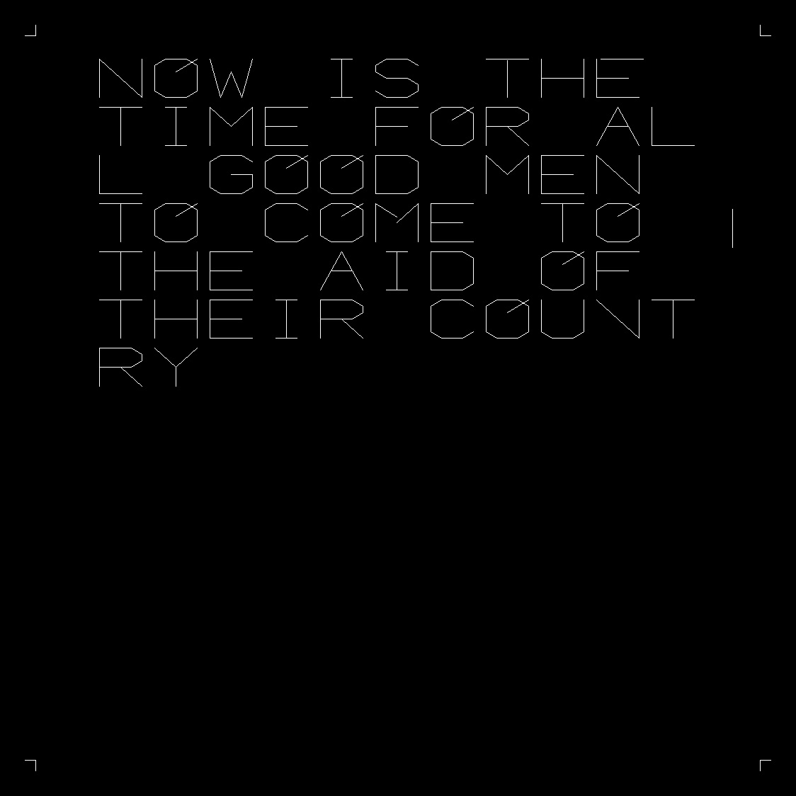
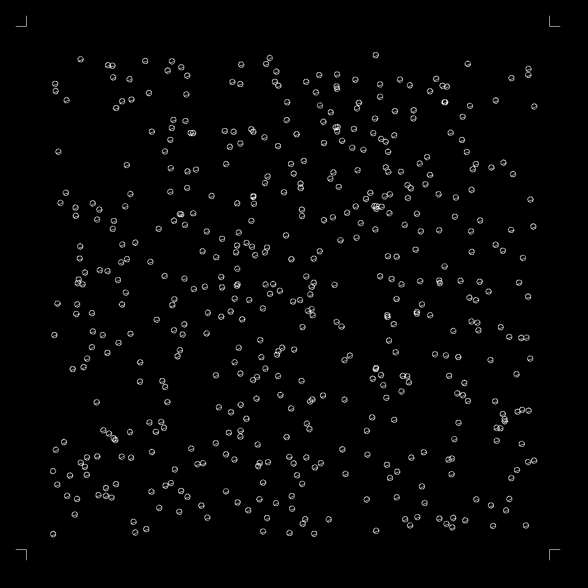

This is currently in a rough state, so here be dragons!

# What is the SC4020?

The Stromberg-Carlson SC4020 was a fancy microfilm plotter(http://www.chilton-computing.org.uk/acl/technology/sc4020/overview.htm). It was built in the 1960s and used for some of the earliest computer animations. The plotter follows a series of instructions on tape to draw vectors and plot text characters on film. It was a pretty spiffy machine.

# What do outputs look like?

# Why emulate the 4020?

Two main reasons:

1. The early films generated using the SC4020 are of historical importance, but not neccesarily well preserved. Scans of the output films have been created, but are in low resolution. Emulation can provide a more long term way to archive and view these films.

2. The 4020 is actually a pretty simple machine, so emulation isn't very complicated.

# What's here?

My emulator is composed of two components: the actual SC4020 emulator, and a FORTRAN library. The emulator, sc4020.py, simply takes a set of instructions and follows them. The output is a set of png files representing each frame. The FORTRAN component is a recreaton of PLOT, the library that initially shipped with the SC4020. These two components give a good toolkit for recreating old plots and animations.

# What's not here?

Currently, things are pretty bare bones. To begin with, the emulator script only accepts very specificalyl formatted data. You have to pass instructions encoded as octal, which can be annoying to deal with. What SC4020 programs I can find follow this format, so I'm sticking to it.

The font is also very wrong, and not complete. I am working on a correct font set, but for now am using an open source DOS font. It works as a placeholder, but is not historically acurate and is missing a few characters. There are also some unimplemented text plotting features. This first round of development has been focused on just getting mostly accurate data on screen.

The PLOT library is also missing some features. All the vector calls are in place, plus simple text plotting. I haven't implemented functiosn for generating grids and charts. I'm also missing the point plotting features since those use a special character I currently don't have implemented.

# Where can you learn more?

Lucily, I don't really need to write docs. This is all a historic recration based on existing docs! Here's the big data dump if you want to get up and running:

http://www.chilton-computing.org.uk/acl/pdfs/sc4020_ref_manual.pdf

Most of the FORTRAN examples in the manual work(except examples that use grids).

The instruction set is more graphically explained here:

http://content-animation.org.uk/computers_and_animation/ordercode.htm

Some of the example SC4020 programs are pulled from this paper:

http://content-animation.org.uk/htmls/grovesbr.htm

# Where to go from here?

This project has mainly been a way to grab some low hanging fruit, and setup tooling for later use. Right now I only have a handful of extant programs for the SC4020 and PLOT. The big important data sources, specifically the work of Zajac and Knowlton, have yet to surface. I'm working on trackign those down, and will have a way to reimplement their anumations when the time comes.

The next big steps are to finish fleshing out PLOT, and implement a custom font set for the emulation script.